<h2 align="center">
    ⚡ Zerohertz ⚡
</h2>

<p align="center">
    <a href="https://zerohertz.github.io/about/" target="_blank">
        
    </a>
    <a href="https://scholar.google.com/citations?user=TxiJyc0AAAAJ" target="_blank">
        
    </a>
    <a href="mailto:ohg3417@gmail.com" target="_blank">
        
    </a>
    <br/>
    <a href="https://cal.com/zerohertz?redirect=false" target="_blank">
        
    </a>
    
</p>

```yaml
2024.12 ~ Present: Machine Learning Engineer at GenON, Korea
2024.09 ~ 2024.11: Backend Engineer at Tmax WAPL, Korea
2023.02 ~ 2024.09: Machine Learning Research Engineer at AgileSoDA, Korea
2021.03 ~ 2023.02: M.S. in Mechanical Design and Production Engineering, Konkuk University, Korea
    ㄴ 2021.03 ~ 2023.02: Research Student at SiM Lab. (Smart intelligent Manufacturing system Laboratory)
2017.03 ~ 2021.02: B.S. in Department of Mechanical Engineering, Konkuk University, Korea
    ㄴ 2019.11 ~ 2021.02: Research Intern at SiM Lab. (Smart intelligent Manufacturing system Laboratory)
    ㄴ 2018.06 ~ 2019.11: Research Intern at MRV Lab. (Medical Robotics and Virtual Reality Laboratory)
```

<h2 align="center">
    <a href="https://github.com/stars/Zerohertz/lists/00-dev-environments" target="_blank">
        🛠️ Dev Environments 🛠️
    </a>
</h2>

<div align="center">
<a href="https://github.com/Zerohertz/dotfiles/blob/main/macos" target="_blank"></a>
<a href="https://github.com/Zerohertz/dotfiles/blob/main/.config/kitty/kitty.conf" target="_blank"></a>
<a href="https://github.com/Zerohertz/dotfiles/blob/main/.zshrc" target="_blank"></a>
<a href="https://github.com/Zerohertz/nvim" target="_blank"></a>
</div>

<div align="center">
  <table>
    <tr>
      <td width="50%" valign="top">
        
        
      </td>
      <td width="50%" valign="top">
        
        
        
        <!--  -->
        <!--  -->
      </td>
    </tr>
  </table>
</div>

---

<h2 align="center">
    <a href="https://zerohertz.github.io/" target="_blank">
        
    </a>
</h2>

<!-- BLOG-POST-LIST:START -->
- [Paper Review: PagedAttention](https://zerohertz.github.io/paper-review-pagedattention/)
- [Code Review: Deep Dive into vLLM&#39;s Architecture and Implementation Analysis of OpenAI-Compatible Serving &lpar;2/2&rpar;](https://zerohertz.github.io/vllm-openai-2/)
- [Code Review: Deep Dive into vLLM&#39;s Architecture and Implementation Analysis of OpenAI-Compatible Serving &lpar;1/2&rpar;](https://zerohertz.github.io/vllm-openai-1/)
- [System Design Interview Volume 2 &lpar;9&rpar;](https://zerohertz.github.io/system-design-interview-volume-2-9/)
- [System Design Interview Volume 2 &lpar;8&rpar;](https://zerohertz.github.io/system-design-interview-volume-2-8/)
<!-- BLOG-POST-LIST:END -->
