<h2 align="center">
    ⚡ Zerohertz ⚡
</h2>

> Interested in backend engineering, DevOps, MLOps

<p align="center">
    <a href="https://zerohertz.github.io/about/">
        
    </a>
    <a href="https://scholar.google.com/citations?user=TxiJyc0AAAAJ">
        
    </a>
    <a href="mailto:ohg3417@gmail.com">
        
    </a>
    
</p>

```yaml
2024.12 ~ Present: Machine Learning Engineer at GenON, Korea
2024.09 ~ 2024.11: Backend Engineer at Tmax WAPL, Korea
2023.02 ~ 2024.09: Machine Learning Research Engineer at AgileSoDA, Korea
2021.03 ~ 2023.02: M.S. in Mechanical Design and Production Engineering, Konkuk University, Korea
    ㄴ 2021.03 ~ 2023.02: Research Student at SiM Lab. (Smart intelligent Manufacturing system Laboratory)
2017.03 ~ 2021.02: B.S. in Department of Mechanical Engineering, Konkuk University, Korea
    ㄴ 2019.11 ~ 2021.02: Research Intern at SiM Lab. (Smart intelligent Manufacturing system Laboratory)
    ㄴ 2018.06 ~ 2019.11: Research Intern at MRV Lab. (Medical Robotics and Virtual Reality Laboratory)
```

<h2 align="center">
    <a href="https://github.com/stars/Zerohertz/lists/00-dev-environments">
        🛠️ Dev Environments 🛠️
    </a>
</h2>

<div align="center">
<a href="https://github.com/Zerohertz/dotfiles/blob/main/macos"></a>
<a href="https://github.com/Zerohertz/dotfiles/blob/main/.config/kitty/kitty.conf"></a>
<a href="https://github.com/Zerohertz/dotfiles/blob/main/.zshrc"></a>
<a href="https://github.com/Zerohertz/nvim"></a>
</div>

<div align="center">
  <table>
    <tr>
      <td width="50%" valign="top">
        
        
      </td>
      <td width="50%" valign="top">
        
        
        <!--  -->
        <!--  -->
      </td>
    </tr>
  </table>
</div>

<!--
<p align="center">
  
</p>
-->

---

<h2 align="center">
    <a href="https://zerohertz.github.io/">
        
    </a>
</h2>

<!-- BLOG-POST-LIST:START -->
- [Distributed Computing with RDMA and RoCE](https://zerohertz.github.io/distributed-computing-rdma-roce/)
- [System Design Interview Volume 2 &lpar;5&rpar;](https://zerohertz.github.io/system-design-interview-volume-2-5/)
- [System Design Interview Volume 2 &lpar;4&rpar;](https://zerohertz.github.io/system-design-interview-volume-2-4/)
- [System Design Interview Volume 2 &lpar;3&rpar;](https://zerohertz.github.io/system-design-interview-volume-2-3/)
- [System Design Interview Volume 2 &lpar;2&rpar;](https://zerohertz.github.io/system-design-interview-volume-2-2/)
<!-- BLOG-POST-LIST:END -->
